# Table of Contents
- [Overview](#overview)
- [Approach](#approach)
- [Deployment](#deployment)
- [Developer Guide](#developer-guide)
- [User Guide](#user-guide)
- [Development History](#development-history)
- [Meet the Developers](#meet-the-developers)

# Overview
VolunteerAlly is a non-profit organization designed to help pair volunteers with organizations in need of service. Thus, the rainbowgeeks team has designed a web application that aims to ease the user's experience when it comes to finding, applying, and volunteering for an organization.

# Approach
When a volunteer signs up for an account and creates their profile, they can add information about their interests, environmental preferences, and availability to better pair them with an organization or opportunity. 

Representatives of organizations can also sign up for an account and post their opportunities as a way to find and recruit volunteers.

Meanwhile, administrators monitor the site for inappropriate content or assist new users in the onboarding process.

Some mockup pages include:
- Landing page
- About Us
- Volunteer Profile
- Organization Profile
- Edit Profile
- Browse Opportunities
- Organization Library

# Deployment
Application is not currently deployed.


# Developer Guide

## Installation
- First, [install meteor](https://www.meteor.com/developers/install).
- Second, download the [rainbowgeeks repository](https://github.com/rainbowgeeks/rainbowgeeks) into your local system.
- Third, open a terminal and navigate into the rainbowgeeks/app directory.
- Fourth, install the required meteor libraries by typing the following into the terminal:

```
$ meteor npm install
```

## Running the Application
- Upon completion of the installation process, ensure you are still in the rainbowgeeks/app directory and enter the following into the terminal:

```
$ meteor npm run start
```

- If this is your first time starting the application, it will create the default data. This should be the output:

```
=> Started proxy.
=> Started MongoDB.
I20220322-11:29:47.042(-10)? Creating the default user(s)
I20220322-11:29:47.063(-10)?   Creating user admin@foo.com with role ADMIN.
I20220322-11:29:47.171(-10)? Defining ADMIN admin@foo.com with password changeme
I20220322-11:29:47.175(-10)?   Creating user john@foo.com with role USER.
I20220322-11:29:47.284(-10)? Defining USER john@foo.com with password changeme
I20220322-11:29:47.287(-10)?   Creating user perkin@foo.com with role USER.
I20220322-11:29:47.381(-10)? Defining USER perkin@foo.com with password changeme
I20220322-11:29:47.383(-10)?   Creating user robin@foo.com with role USER.
I20220322-11:29:47.470(-10)? Defining USER robin@foo.com with password changeme
I20220322-11:29:47.473(-10)?   Creating user americanredcross@foo.com with role ORGANIZATION.
I20220322-11:29:47.572(-10)? Defining ORGANIZATION americanredcross@foo.com with password changeme
I20220322-11:29:47.574(-10)?   Creating user hugs@foo.com with role ORGANIZATION.
I20220322-11:29:47.658(-10)? Defining ORGANIZATION hugs@foo.com with password changeme
I20220322-11:29:47.662(-10)?   Creating user paph@foo.com with role ORGANIZATION.
I20220322-11:29:47.752(-10)? Defining ORGANIZATION paph@foo.com with password changeme
I20220322-11:29:47.754(-10)?   Creating user readtome@foo.com with role ORGANIZATION.
I20220322-11:29:47.837(-10)? Defining ORGANIZATION readtome@foo.com with password changeme
I20220322-11:29:47.838(-10)?   Creating user htbg@foo.com with role ORGANIZATION.
I20220322-11:29:47.924(-10)? Defining ORGANIZATION htbg@foo.com with password changeme
I20220322-11:29:47.926(-10)?   Creating user hawaiihumane@foo.com with role ORGANIZATION.
I20220322-11:29:48.010(-10)? Defining ORGANIZATION hawaiihumane@foo.com with password changeme
I20220322-11:29:48.017(-10)? Creating default data.
I20220322-11:29:48.017(-10)?   Adding: Basket (john@foo.com)
I20220322-11:29:48.032(-10)?   Adding: Bicycle (john@foo.com)
I20220322-11:29:48.034(-10)?   Adding: Banana (admin@foo.com)
I20220322-11:29:48.036(-10)?   Adding: Boogie Board (admin@foo.com)
I20220322-11:29:48.039(-10)? Creating default Organization.
I20220322-11:29:48.040(-10)?  Adding Organization: The American Red Cross of Hawaii
I20220322-11:29:48.096(-10)?  Adding Organization: HUGS
I20220322-11:29:48.105(-10)?  Adding Organization: Protect and Preserve Hawaii
I20220322-11:29:48.114(-10)?  Adding Organization: Read To Me International
I20220322-11:29:48.124(-10)?  Adding Organization: Hawaii Tropical BioReserve & Garden
I20220322-11:29:48.134(-10)?  Adding Organization: Hawaiian Humane Society
I20220322-11:29:48.152(-10)? Creating default Opportunities.
I20220322-11:29:48.209(-10)?  Adding: Disaster Response - Disaster Action Team (mattie@foo.com)
I20220322-11:29:48.312(-10)?  Adding: View & Power BI Applications Lead 18+ (blake@foo.com)
I20220322-11:29:48.344(-10)?  Adding: Regional Training Instructor (bary@foo.com)
I20220322-11:29:48.374(-10)?  Adding: Hurricane Evacuation Shelter Volunteers (mattie@foo.com)
I20220322-11:29:48.405(-10)?  Adding: Koa Memorial Garden (mac@foo.com)
I20220322-11:29:48.436(-10)?  Adding: Crafting activity set up and break down (cullen@foo.com)
I20220322-11:29:48.465(-10)?  Adding: SuperChill Saturday (felix@foo.com)
I20220322-11:29:48.491(-10)?  Adding: Mauka Missions (felix@foo.com)
I20220322-11:29:48.513(-10)?  Adding: Ho'omaluhia Botanical Garden (annabal@foo.com)
I20220322-11:29:48.538(-10)?  Adding: Hawaiian Humane Society - Dog Walker (obadiah@foo.com)
I20220322-11:29:48.558(-10)?  Adding: Test Opportunity (jackie@foo.com)
I20220322-11:29:48.573(-10)? Creating default profile-users.
I20220322-11:29:48.573(-10)?  Adding: John (john@foo.com)
I20220322-11:29:48.587(-10)?  Adding: Marry (robin@foo.com)
I20220322-11:29:48.589(-10)?  Adding: Perkin (perkin@foo.com)
I20220322-11:29:48.634(-10)? Monti APM: completed instrumenting the app
=> Started your app.

=> App running at: http://localhost:3000/
   Type Control-C twice to stop.

```
- You can now open up your app on a webpage at: [http://localhost:3000/](http://localhost:3000/)
- To reset the app, exit meteor by pressing Control-C into the terminal, and type:

```
$ meteor reset
```

# User Guide
The following mockup pages will serve as a basis for the final implementation of the project. 

## Landing Page
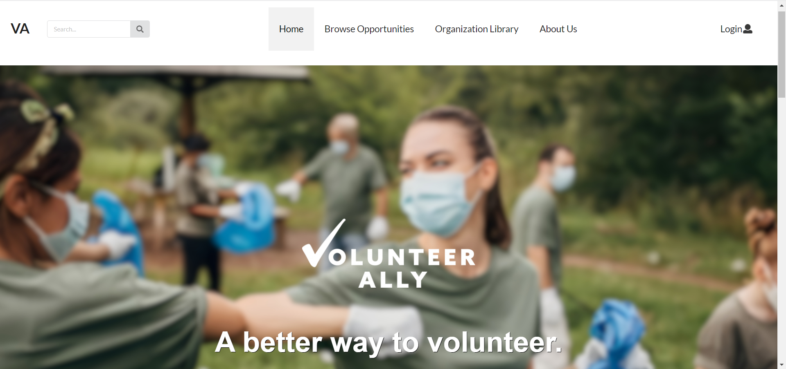

Upon entering the website, the user can:
- Sign up for a new account
- Log in to an existing account
- Visit the Browse Opportunities page
- Visit the About Us page

### Sign Up Page
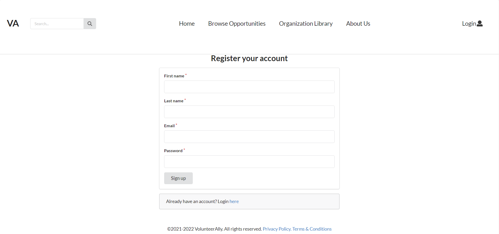

### Login Page
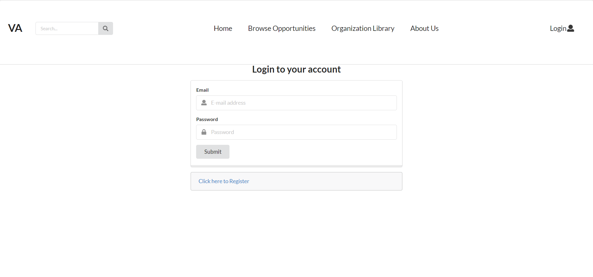

## Browse Opportunities Page
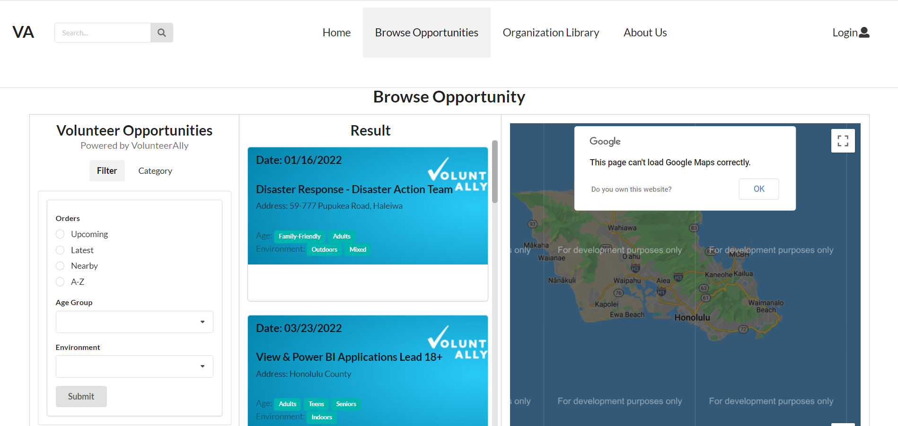

### About Us Page
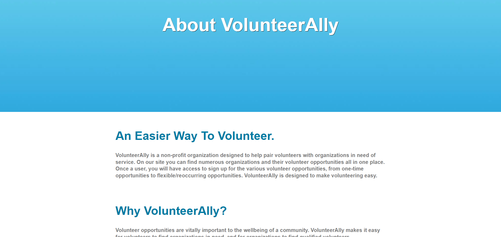

## Administrator
Administrators have full access to the site and are able to manage volunteer accounts, organization accounts, and opportunties from the Admin Profile Page.

From this page, administrators can also:
- Edit their account information
- Change site preferences
- View site analytics

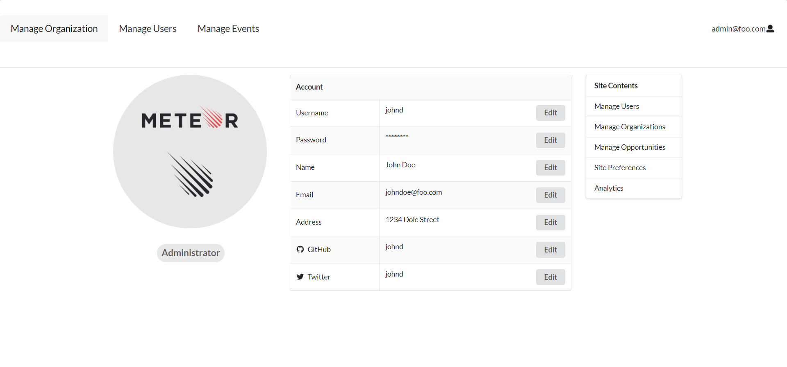

Using the following subsites, administratorss can add, delete, or edit users and opportunity information.

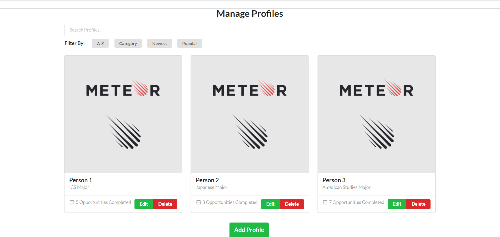
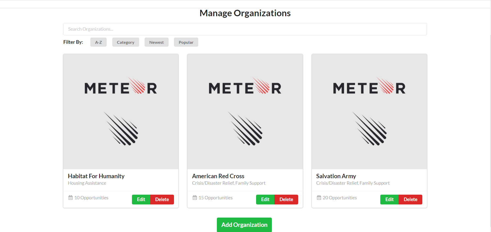
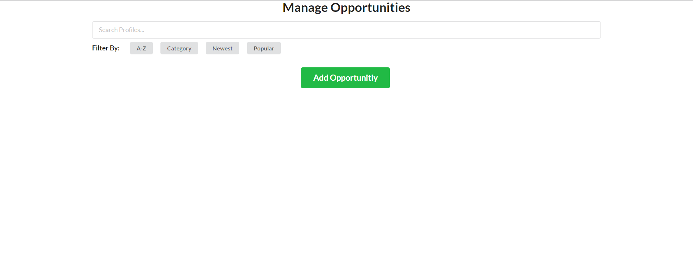

## Organization User
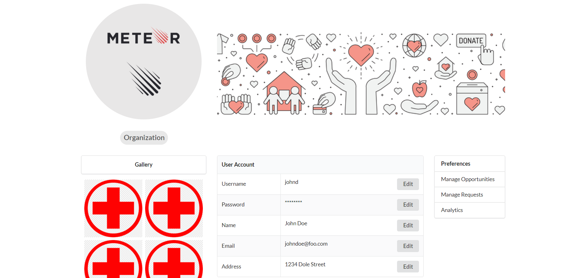
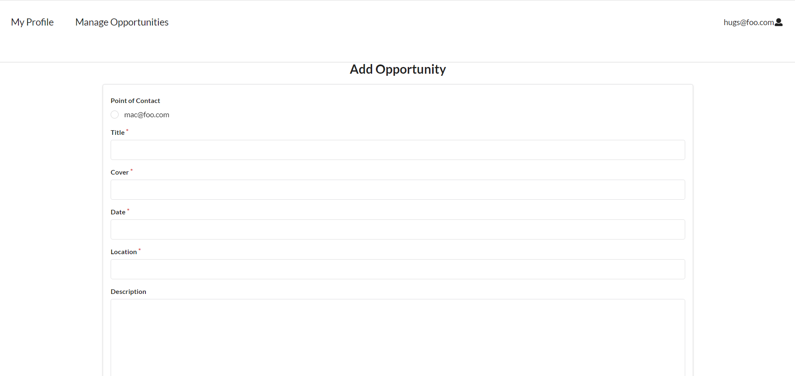
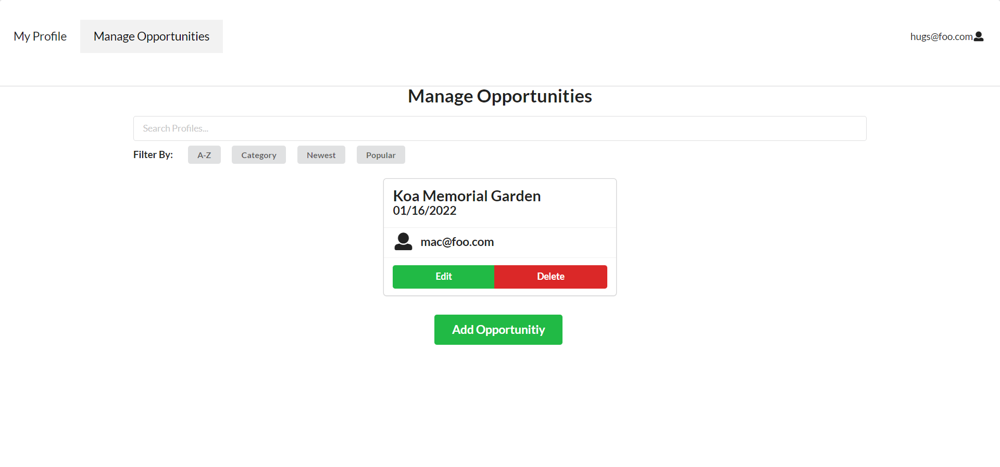

## Volunteer User
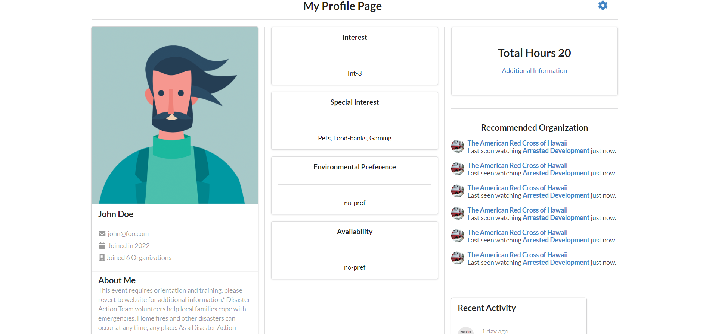
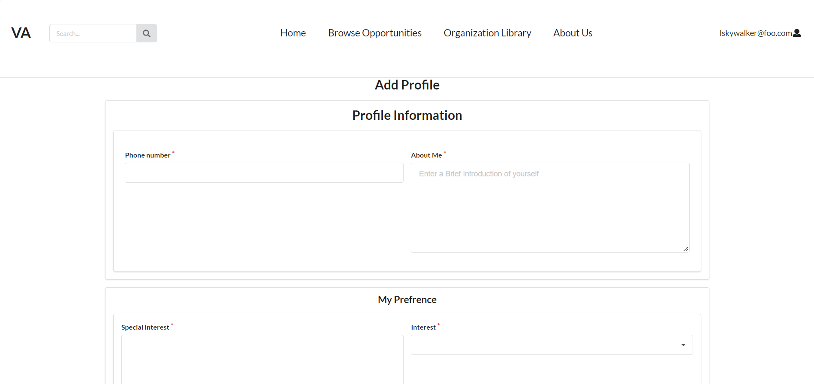
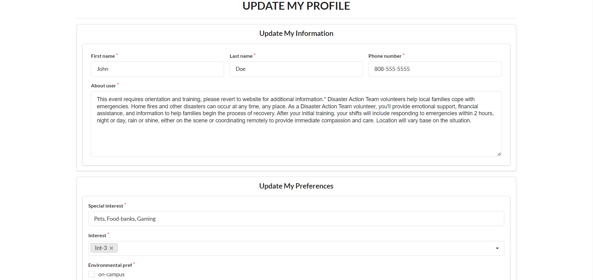
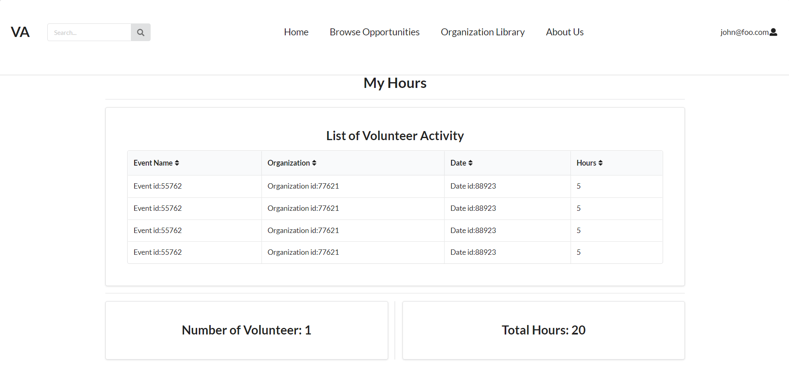

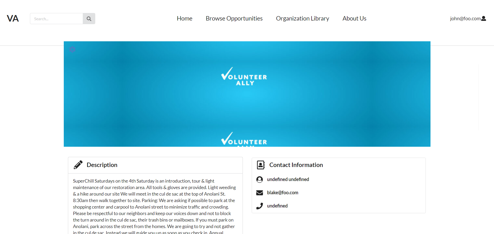
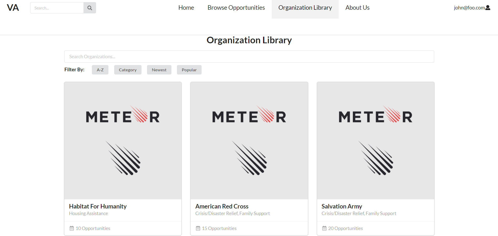

# Development History

- Goals of [Milestone 1](https://github.com/rainbowgeeks/rainbowgeeks/projects/1): Create Mockup Pages, start Front-End Development, and Initial Deployment
- Goals of [Milestone 2](https://github.com/rainbowgeeks/rainbowgeeks/projects/2): Significantly improve functionality of app, continue Front-End Development, meet with VolunteerAlly to discuss design decisions
- Goals of [Milestone 3](https://github.com/rainbowgeeks/rainbowgeeks/projects/3): Significantly improve functionality of app from M2 with a focus on Organization user interaction with the website, continue Front-End and Back-End Development
- Goals of [Milestone 4](https://github.com/rainbowgeeks/rainbowgeeks/projects/4): Significantly improve functionality of app from M3 with a focus on Volunteer user interaction with the website, continue Front-End and Back-End Development, meet with VolunteerAlly to discuss progress

# Meet the Developers

- [Marcos Buccat]
- [Kristian Lazo]
- [Isaiah Eusebio]
- [Jonathan Ma]
- [Matthew Ito]
- [John Suelen]
