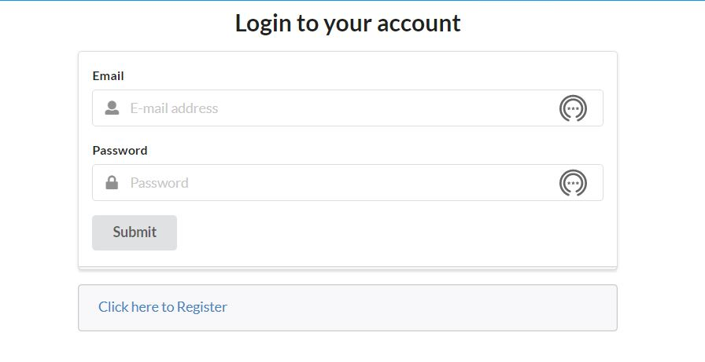

## Overview

The goal of this application is to ease the user's experiance when it comes to finding, applying, and volunteering for an orginization. This will be done by matching a user's prefrencese to the orginizations stored in our database and then keeping track of the user's volunterring hours. At the same time the orginization will be able to register their orginization to our database. 

The tool we we will be using for this application is MATRP.

## VolunteerAlly Web Application Mock-up Pages

### Home Page

### Login Page

### Sign Up Page

### Navigation Bar

### Add Profile Page

### Admin Profile Page

### Browse Opportunities Page

### Edit Profile Page

### Organization Library Page

### User Profile Page

## Team Members

[John Suelen] 

[Marcos Buccat Jr.]

[Matthew]

[Jonathan M]

[Kristian]

[Isaiah Eusebio]

